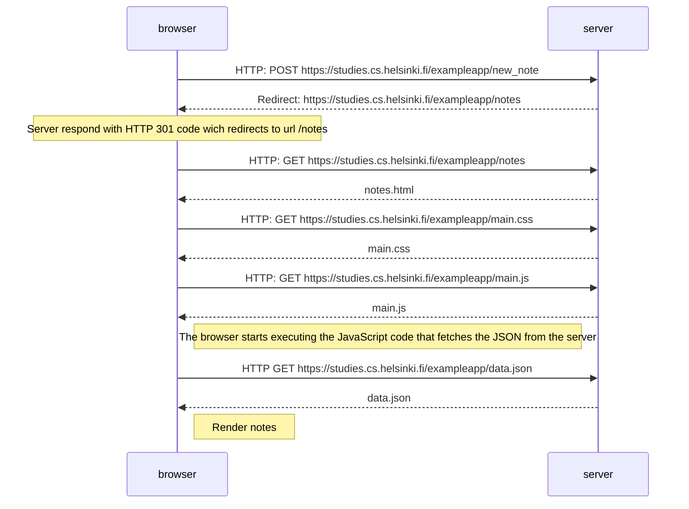

# New note diagram

```mermaid
sequenceDiagram
participant browser
participant server

browser->>server: HTTP: POST https://studies.cs.helsinki.fi/exampleapp/new_note
server-->>browser: Redirect: https://studies.cs.helsinki.fi/exampleapp/notes
Note over browser: Server respond with HTTP 301 code wich redirects to url /notes

browser->>server: HTTP: GET https://studies.cs.helsinki.fi/exampleapp/notes
server-->>browser: notes.html
browser->>server: HTTP: GET https://studies.cs.helsinki.fi/exampleapp/main.css
server-->>browser: main.css
browser->>server: HTTP: GET https://studies.cs.helsinki.fi/exampleapp/main.js
server-->>browser: main.js

Note right of browser: The browser starts executing the JavaScript code that fetches the JSON from the server
browser->>server: HTTP GET https://studies.cs.helsinki.fi/exampleapp/data.json
server-->>browser: data.json

Note right of browser: Render notes

```