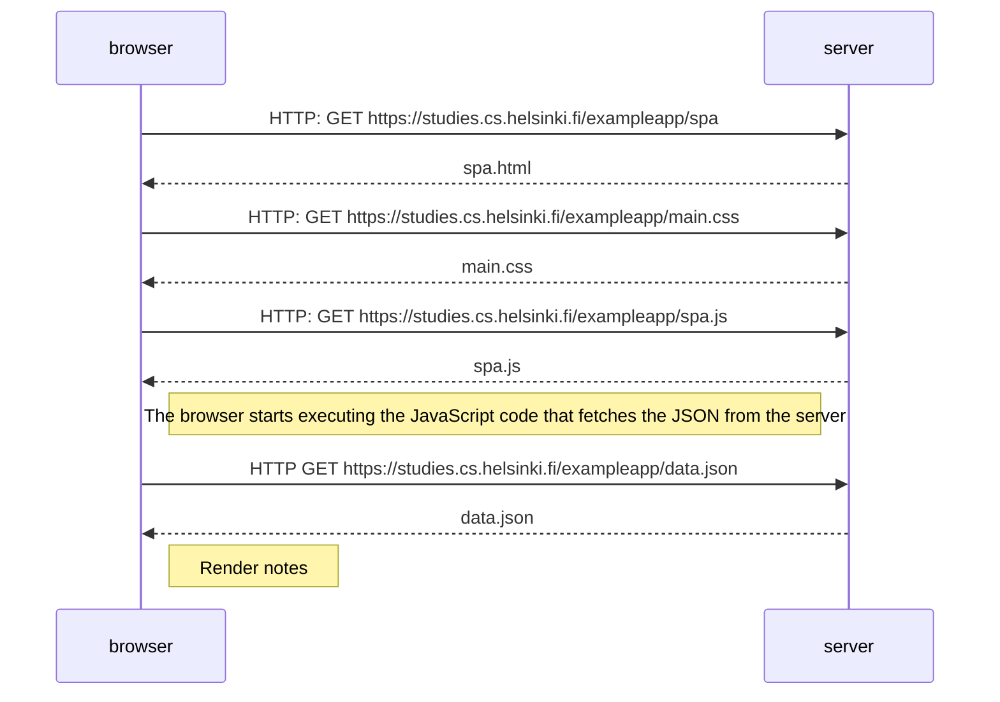

# Single page app diagram

```mermaid
sequenceDiagram
participant browser
participant server
 
browser->>server: HTTP: GET https://studies.cs.helsinki.fi/exampleapp/spa
server-->>browser: spa.html

browser->>server: HTTP: GET https://studies.cs.helsinki.fi/exampleapp/main.css
server-->>browser: main.css

browser->>server: HTTP: GET https://studies.cs.helsinki.fi/exampleapp/spa.js
server-->>browser: spa.js

Note right of browser: The browser starts executing the JavaScript code that fetches the JSON from the server
browser->>server: HTTP GET https://studies.cs.helsinki.fi/exampleapp/data.json
server-->>browser: data.json

Note right of browser: Render notes

```