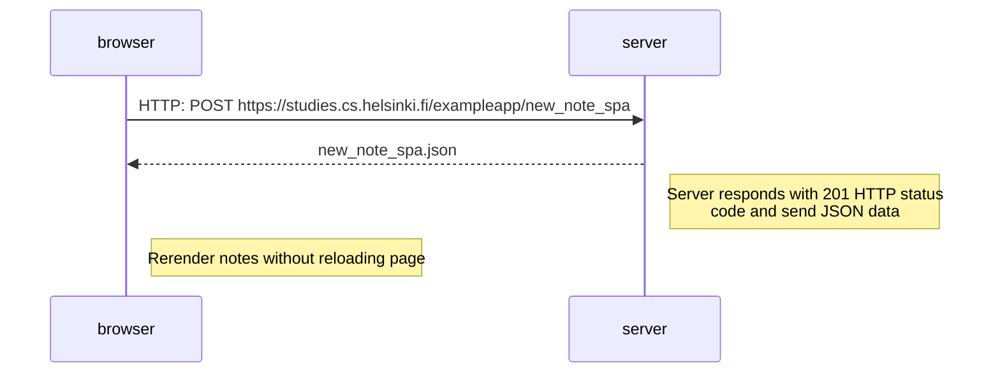

# New note on Single Page App diagram

```mermaid
sequenceDiagram
participant browser
participant server
 
browser->>server: HTTP: POST https://studies.cs.helsinki.fi/exampleapp/new_note_spa
server-->>browser: new_note_spa.json
Note right of server: Server responds with 201 HTTP status <br/>code and send JSON data

Note right of browser: Rerender notes without reloading page

```